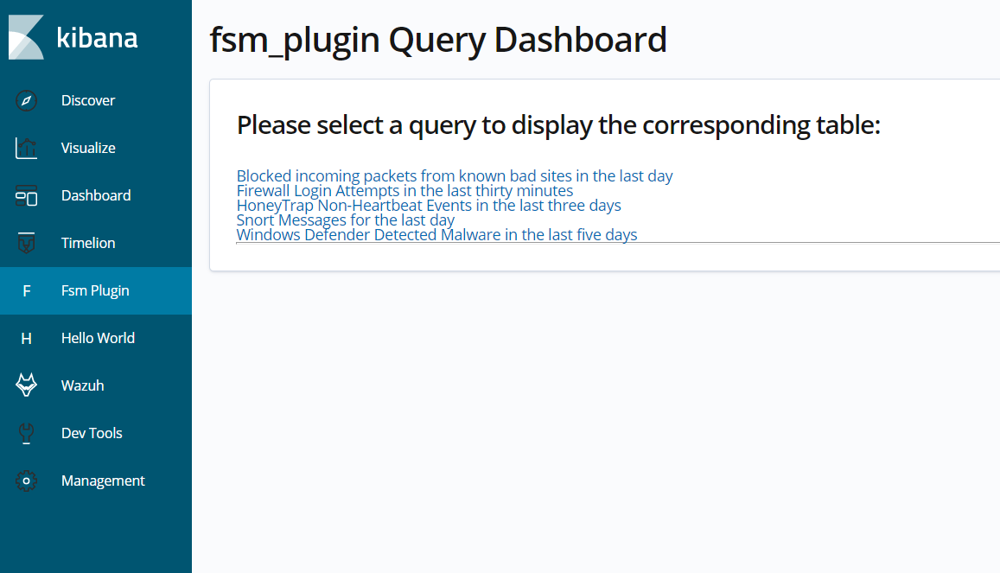
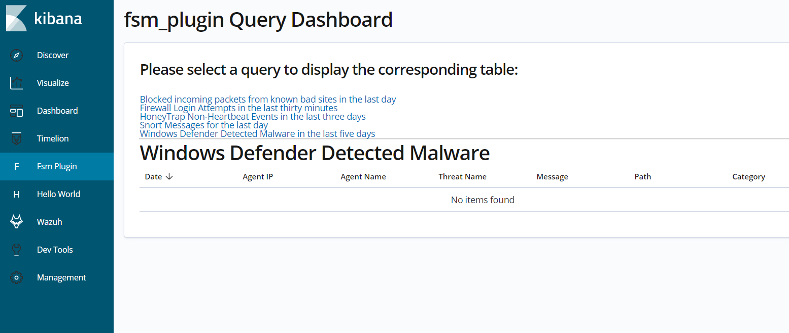
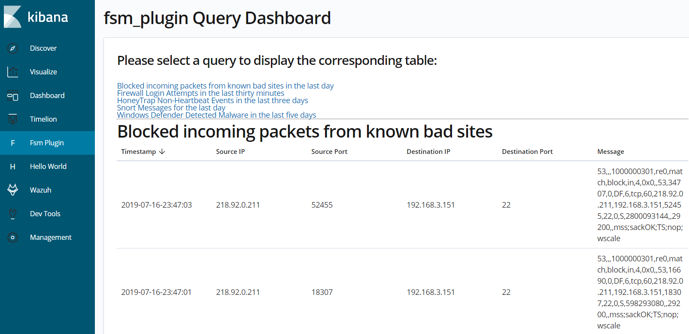

# fsm_plugin

> Federated Security Module Plugin

This plugin was developed for Kibana 6.7.1 and displays queries in various tables to assist with identifying Advanced Persistent Security Threats (APST). The main purpose of this plugin is to demonstrate how queries can be used to return data from Elasticsearch and displayed in an interface for the analyst to gather information quickly.

## Examples of Query Screens

When you first open up the plugin it will display a list of the available queries.  You can activate a query by clicking on it.



Some queries may not have any data associated with them and will return an empty result.



If the query returns data, it will be displayed in multi-page table.  All queries are returned in reverse chronological order from the most recent event to the oldest event.



---

## development

See the [kibana contributing guide](https://github.com/elastic/kibana/blob/master/CONTRIBUTING.md) for instructions setting up your development environment. Once you have completed that, use the following yarn scripts.

  - `yarn kbn bootstrap`

    Install dependencies and crosslink Kibana and all projects/plugins.

    > ***IMPORTANT:*** Use this script instead of `yarn` to install dependencies when switching branches, and re-run it whenever your dependencies change.

  - `yarn start`

    Start kibana and have it include this plugin. You can pass any arguments that you would normally send to `bin/kibana`

      ```
      yarn start --elasticsearch.hosts http://localhost:9220
      ```

  - `yarn build`

    Build a distributable archive of your plugin.

  - `yarn test:browser`

    Run the browser tests in a real web browser.

  - `yarn test:server`

    Run the server tests using mocha.

For more information about any of these commands run `yarn ${task} --help`. For a full list of tasks checkout the `package.json` file, or run `yarn run`.
